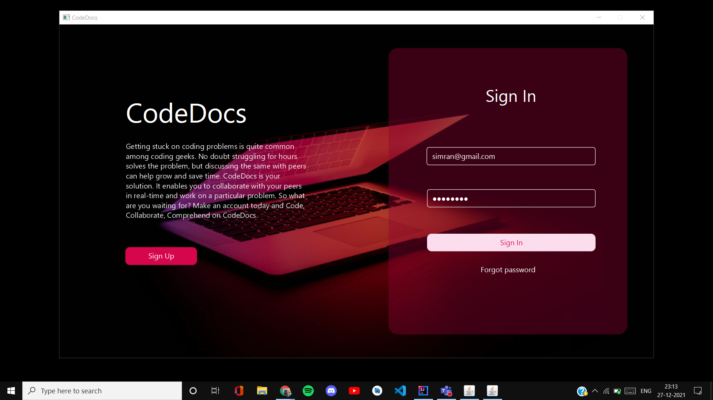
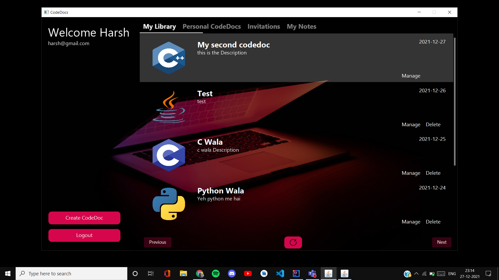

<h1 align="center">CodeDocs</h1>
<h2 align="center"><i>Code, Collaborate, Comprehend on CODEDOCS !</i></h2>

# Table of Contents

* [ About CodeDocs ](#about)
* [ What it does ](#features)
* [What's next for CodeDocs](#future)
* [Instructions to run](#instructions)
* [ A Glimpse of CodeDocs ](#images)
* [ Contributors ](#contributors)

# About CodeDocs
Getting stuck on coding problems is quite common among coding geeks. No doubt struggling for hours solves the problem, but discussing the same with peers can help grow and save time. So our team thought of why not build a collaborative coding platform. CodeDocs enables users to collaborate with other users in real-time and work on a particular problem. 

# What it does
* A user can signup/login/logout.
* Email verification.

 
 
* User can create/edit/save CodeDoc.
* Users can fetch his previous codeDocs and those he collaborates with.

* Users can allow other users to edit/see in their CodeDoc by sending invites, and the receiver can accept/reject it. 
* The owner of the CodeDoc can change the write permissions of the collaborators and remove them.

* Coding area supports writing and compiling code in four languages. (Java, C , C++, Python)
* Coding area shows line numbers.
* Coding area has highlighting/autocomplete/recommendation feature according to language (implemented using trie).

* Users can run programs by providing input and can have output.

* Chat section where users can send/receive messages both privately and to everyone.

* When any user updates in the CodeDoc the same change is reflected in every other user's window, working on the same CodeDoc.
* Cursors for users are displayed with their respective names in every other user's window, working on the same CodeDoc.

* Audio communication between users.

* Multiple tabs for each collaborative session.
* Users can take screenshots and notes as a future reference for specific algorithms.

# What's next for CodeDocs
* Add debug option.
* Add download CodeDoc feature for offline working.
* Implement code indentation.
* Implement video communication among the collaborators.
* Implement some advanced synchronization while editing CodeDoc.

# Instructions to run
* Clone the repository. 
* Import codedocs.sql into your mysql workbench.
* Create the following configuration files and specify value for each field.
    *  /CodeDocs-Server/src/main/resources/configurations/auth.properties
    

  
    *  /CodeDocs-Server/src/main/resources/configurations/db.properties
    

    
    *  /CodeDocs-Server/src/main/resources/configurations/server.properties
    

    
    *  /CodeDocs-Server/src/main/resources/configurations/mail.properties
    

    
    
    *  /CodeDocs-Client/src/main/resources/configurations/server.properties
    

  
    *  /CodeDocs-Client/src/main/resources/configurations/file.properties
    

* Start the server and then client. Try hands on CodeDocs and give us your valuable feedback.     
    

# A Glimpse of CodeDocs

# Contributors
* [Harsh Gyanchandani](https://github.com/harshh3010)
* [Gursimran Kaur Saini](https://github.com/gursimran18)

